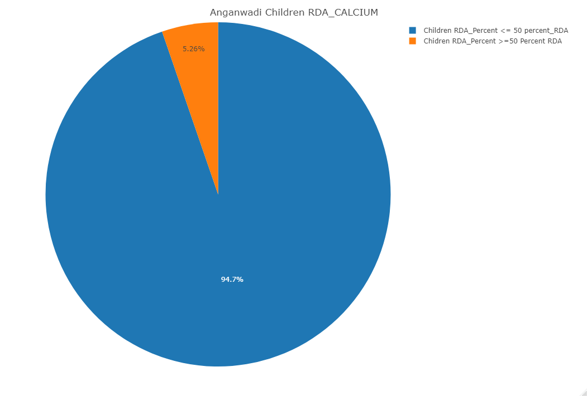

# MLP-0231

## Data Analytics based on diet diversity, Food Consumption and Nutritional deficiency targeted to the selected Aspirational districts in                                                           Karnataka and Kerala

# RDA Results for Anganwadi Children 

RDA CALCIUM RESULT

